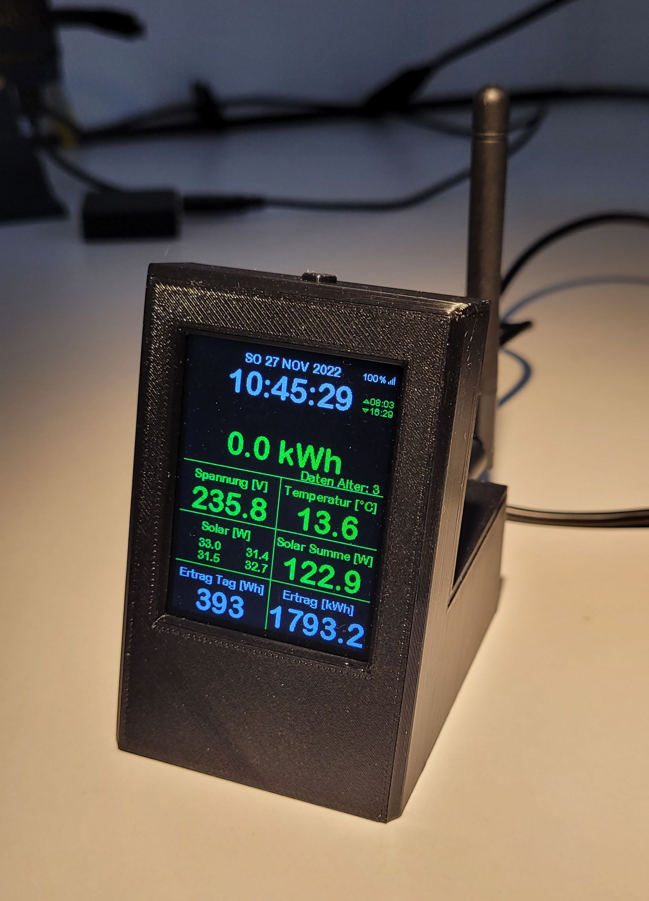
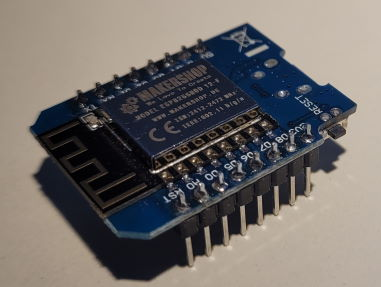
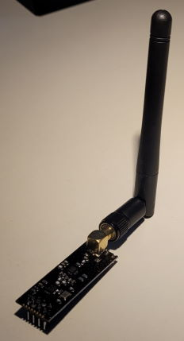
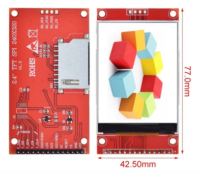
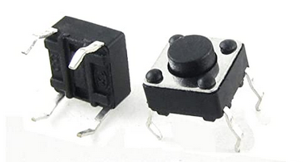
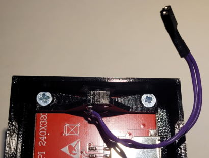

# WifiDisplay

A project for communicating with Hoymiles solar inverters combined with the option to display different values on a 2.4 inch TFT display. 

## Preface
Inspired from the [discussion](https://www.mikrocontroller.net/topic/525778) on (Mikrocontroller.net) I also started investigating on protocol and communication details. With [this](https://www.mikrocontroller.net/topic/525778?page=single#7014857)
 post a first contact to the inverters was the base for several projects.
I wanted an independent display to always have an overview of the current yield data in a simple and clear manner.

   

This project is still a work in progress. It is far away from the almost perfect and comfortable and easy to use solutions from other projects. 

Some more pictures of the latest prototype can be found [here](docs/images/README.md).
---
## Firmware

The firmware for the EPS8266 microcontroller is build with Arduino PlatformIO Framework for the ESP8266. 

It uses a snapshot or a fork of the following projects:

- [ThingPulse minigrafx](https://github.com/ThingPulse/minigrafx)
- [Bounce2](https://github.com/thomasfredericks/Bounce2)
- [RobTillaart CRC](https://github.com/RobTillaart/CRC)
- [BuelowP sunset](https://github.com/buelowp/sunset)

and some more (experimental)...

---
## Hardware - Required components and material 

### ESP8266 WeMos D1 mini

As controller platform a WeMos D1 mini compatible ESP8266 board is required.

Sample picture

Source of supply
[Makershop](https://www.makershop.de/plattformen/d1-mini/esp8266-mini-board/)
[AZ-Delivery](https://www.az-delivery.de/products/d1-mini)

### NRF24L01+ radio board with external antenna

Sample picture

### ILI9341 based TFT Display 320x240 pixel

I always order the TFT modules directly from China via AliExpress. As the suppliers change frequently it is difficult to keep a link updated here. Make sure the pcb has the dimensions 77mm x 42.5mm and a 14 pin header at the bottom for target connection.

**Sample picture**

### BOM for the pcb
|Quantity|Item|
|--------|----|
|2 pc.|socket strip 8x1 pin 6mm heigth 2.56mm pitch|
|1 pc.|socket strip 4x2 pin 2.56mm pitch|
|1 pc.|socket strip 8x1 pin 8mm height 2.56mm pitch|
|1 pc.|pin header 2x1 pin 2.56mm pitch|
|1 pc.|Polarized capacitor 100uF 35V 2.56mm pitch|
|1 pc.|Capacitor SMD 100nF 0603|
|1 pc.|Resistor SMD 10k 0603|
|1 pc.|Resistor SMD 1k 0603|

### Other components and mounting material

**A tact Button Switch 6 x 6 x 4.3 mm**

The switch is used for different options when interacting with the display application. It is mounted inside the housing using the 3D printed mount. The pins of the switch must be bent straight and put through the small holes in the holder as shown on this picture.

|Quantity|Item|
|--------|----|
|4 pc.|Countersunk screw M3 x 5mm|
|6 pc.|Washer 3.2mm|
|4 pc.|Cylinder head screw M3 x 8mm|
|4 pc.|Nuts M3|

---
## Further documentation

### Connection Summary for ILI9341 TFT Display:

ESP8266       -> ILI9341
Vin           -> Vcc        (red)
GND           -> GND        (black)
GPIO 15  (D8) -> CS         (violett)
GPIO 2   (D4) -> RESET      (brown)
GPIO 4   (D2) -> D/C        (gray)
GPIO 13  (D7) -> SDI(MOSI)  (green)
GPIO 14  (D5) -> SCK        (yellow)
GPIO 5   (D1) -> LED        (orange)
GPIO 12  (D6) -> SDO(MISO)  (spare)

---
## Related Projects
- [OpenDTU](https://github.com/tbnobody/OpenDTU)
- [Ahoy](https://github.com/grindylow/ahoy)
- [DTU Simulator](https://github.com/Ziyatoe/DTUsimMI1x00-Hoymiles)
- [OpenDTU extended to talk to Victrons MPPT battery chargers (Ve.Direct)](https://github.com/helgeerbe/OpenDTU_VeDirect)
- [BreakoutBoard - sample printed circuit board for OpenDTU and Ahoy](https://github.com/dokuhn/openDTU-BreakoutBoard)